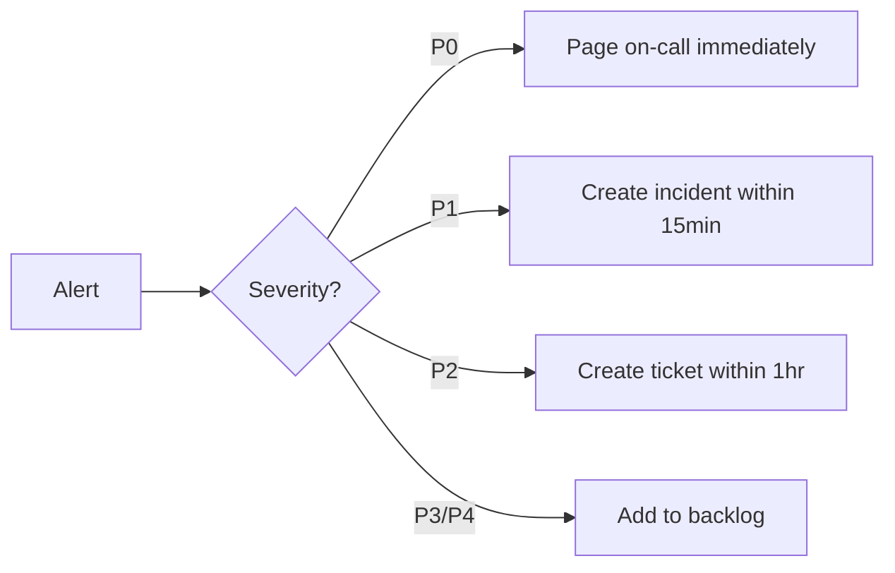

# Incident Response Playbook — Kynthai US

**Owner:** Platform Engineering
**Last Updated:** 2026-07-30
**Review Cadence:** Quarterly

---

## Severity Definitions

| Severity | Label | Definition | Response Time | Examples |
|----------|-------|-----------|---------------|---------|
| **P0** | Critical | Complete service outage or data breach affecting all users | < 5 min | DB down, auth broken, PII exposure |
| **P1** | High | Major feature unavailable or degraded for many users | < 15 min | AI chat down, checkout failing, reminders not sending |
| **P2** | Medium | Partial degradation affecting a subset of users | < 1 hour | Portal slow, one API route timing out |
| **P3** | Low | Cosmetic, non-urgent, or single-user issue | < 1 week | UI glitch, typo, one user report |
| **P4** | Info | Feature request, question, internal tooling | No SLA | Dashboard improvement, docs update |

---

## Detection Channels

| Channel | Tool | Monitored By |
|---------|------|-------------|
| Health check (`/api/health`) | Synthetic monitor (cron) | Platform team |
| Error tracking | Sentry (client + server + edge) | All engineers |
| Performance metrics | Vercel Analytics | Platform team |
| Uptime monitoring | Better Uptime / Checkly | Ops rotation |
| Audit logs | Structured logs (`audit-logger.ts`) | Security team |
| User reports | In-app feedback + support email | CS team |
| Payment failures | Stripe webhooks + dashboard | Backend team|
| Security alerts | Sentry security events | Security lead |

---

## Roles & Responsibilities

| Role | Person | Responsibility |
|------|--------|---------------|
| Incident Commander | On-call engineer | Triage, coordinate, communicate |
| Subject Matter Expert | Affected domain owner | Diagnose and fix |
| Scribe | Rotating engineer | Document timeline in incident doc |
| Communications Lead | Product/CS lead | User-facing status updates |
| Security Lead | Security engineer | P0/P1 with data implications |

### On-Call Schedule

- **Weekdays (9-5):** Primary on-call engineer (rotating weekly)
- **Evenings/Weekends:** Secondary on-call engineer (escalation)
- **Holidays:** Dedicated holiday on-call (US team only)

---

## Incident Lifecycle

### 1. Detection & Triage



1. Alert fires via configured channel
2. On-call acknowledges within severity SLA
3. **If P0/P1**: Incident Commander declares incident in `#incidents` Slack channel
4. Create incident document (copy template from `docs/INCIDENT_TEMPLATE.md`)
5. Assess blast radius and impact

### 2. Mitigation

1. **Stop the bleeding** — Roll back deployment, disable feature flag, block IP
2. **Preserve evidence** — Capture logs, metrics, and state before remediation
3. **Communicate** — Update status page, notify stakeholders
4. **Document** — Scribe records all actions, timestamps, and decisions

### 3. Resolution

1. Confirm fix via health check + synthetic monitoring
2. Verify fix in production
3. Close incident in monitoring tools
4. Announce resolution in `#incidents`

### 4. Postmortem

**Required for:** All P0/P1 incidents. Required within 48 hours.

**Postmortem template:**

```markdown
## Postmortem: [Title]
- Date: 
- Severity: P0/P1/P2
- Duration: 
- Impact: [users affected, $ cost]

## Timeline
- HH:MM — Detection
- HH:MM — Triage
- HH:MM — Mitigation
- HH:MM — Resolution

## Root Cause
[What actually happened]

## Contributing Factors
[Why the root cause was possible]

## Detection Gap
[How we should have caught this earlier]

## Action Items
- [ ] P0 fix: 
- [ ] Monitoring improvement: 
- [ ] Process improvement: 
- [ ] Owner: 
- [ ] Due date:
```

---

## Common Runbooks

### Runbook: Service Down (`/api/health` returns 503)

```bash
# 1. Check Vercel dashboard for deployment status
vercel logs

# 2. Check Sentry for error spike
# https://sentry.io/organizations/kynthai

# 3. Roll back to last known good deployment
vercel rollback

# 4. Check database connectivity
curl https://kynthai.app/api/health

# 5. If DB down, check Supabase dashboard
# https://supabase.com/dashboard/project/[ref]
```

### Runbook: Auth Failure (users can't log in)

```bash
# 1. Check auth rate limits (Upstash)
redis-cli GET "ratelimit:login:*"

# 2. Check Supabase auth logs
# Dashboard → Authentication → Logs

# 3. Verify NEXTAUTH_SECRET is correct
# Compare across deployments

# 4. Check session cookies
# Browser dev tools → Application → Cookies
```

### Runbook: AI Chat Down

```bash
# 1. Check circuit breaker state
# logs show "CircuitBreakerOpenError"

# 2. Verify OpenAI/ZenMux API key
curl -H "Authorization: Bearer $OPENAI_API_KEY" \
  https://api.openai.com/v1/models

# 3. Check for upstream outage
# https://status.openai.com
# https://status.zenmux.com
```

---

## Escalation Paths

| Level | Contact | Method |
|-------|---------|--------|
| Level 1 | On-call engineer | PagerDuty / Slack `@oncall` |
| Level 2 | Engineering lead | Phone / Slack direct message |
| Level 3 | CTO / VP Eng | Phone / Emergency contact |
| External | Supabase support | Dashboard → Support (1hr SLA, Pro plan) |
| External | Vercel support | Dashboard → Support (1hr SLA, Pro plan) |
| External | Stripe support | Dashboard → Support (15min, Critical) |

---

## Post-Deployment Verification

After every production deployment, the CI pipeline runs:

1. **Health check** — `curl https://kynthai.app/api/health` (expects 200)
2. **Smoke test** — Playwright CI smoke suite against production URL
3. **Auth flow** — Verify login page loads and form submits
4. **Landing page** — Verify LCP < 2.5s (Sentry performance)

If any post-deployment check fails, the deployment is automatically flagged for rollback.

---

## Related Documents

- [SLOs & Error Budgets](./SLOS.md)
- [Backup & Restore Runbook](./BACKUP_RESTORE_RUNBOOK.md)
- [Infrastructure Security](./INFRASTRUCTURE_SECURITY.md)
- [Production Readiness Report](./PRODUCTION-READINESS-REPORT.md)
